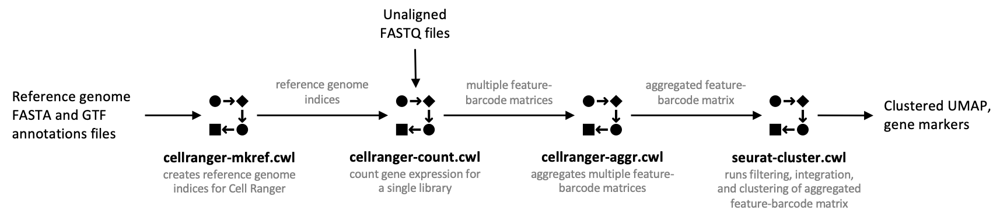

# scRNA-Seq-Analysis

**For detailed tutorial on how to use this set of workflows refer to the [Documenation](https://barski-lab.github.io/scRNA-Seq-Analysis/) page.**

This repository containes CWL pipelines for scRNA-Seq data analysis. Each of the following command line tools was wrapped into CWL format and combined into the workflows.

**Used tools and versions:**
- [Cell Ranger](https://support.10xgenomics.com/single-cell-gene-expression/software/overview/welcome) 4.0.0
- [Cell Ranger ARC](https://support.10xgenomics.com/single-cell-multiome-atac-gex/software/overview/welcome) 2.0.0
- [Seurat](https://satijalab.org/seurat/) 4.0.3
- [FastQC](https://www.bioinformatics.babraham.ac.uk/projects/fastqc/) 0.11.5
- [UCSC Cell Browser](https://github.com/maximilianh/cellBrowser) 1.0.1

The workflows and tools are compatible with any CWL runner (see [CWL official page](https://www.commonwl.org/#Implementations) for a list of available runners).