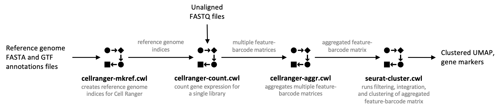

[](https://app.travis-ci.com/Barski-lab/scRNA-Seq-Analysis)
[](https://www.python.org/downloads/release/python-38/)
# scRNA-Seq-Analysis

**For detailed documentation on how to use this set of workflows in SciDAP refer to the [Tutorials](https://barski-lab.github.io/scRNA-Seq-Analysis/) page.**

This repository contains CWL pipelines for scRNA-Seq data analysis. Each of the used command line tools was wrapped into CWL format and combined into the workflows.



**Used tools:**
- [Cell Ranger](https://support.10xgenomics.com/single-cell-gene-expression/software/overview/welcome) 4.0.0
- [Cell Ranger ARC](https://support.10xgenomics.com/single-cell-multiome-atac-gex/software/overview/welcome) 2.0.0
- [Seurat](https://satijalab.org/seurat/) 4.0.3
- [FastQC](https://www.bioinformatics.babraham.ac.uk/projects/fastqc/) 0.11.5
- [UCSC Cell Browser](https://github.com/maximilianh/cellBrowser) 1.0.1

**Running from command line**

All CWL files from this repository are compatible with any workflow management system or runner that implements CWL v1.0 standard (see the list [here](https://www.commonwl.org/#Implementations)). As an example, we will use [cwltool](https://github.com/common-workflow-language/cwltool) (the reference implementation) to show how to get the list of input parameters for any CWL file in order to run it from the command line. Additionally, we will show how to generate a template job definition file to be used as an alternative way of setting workflow input parameters. Please note, for a better portability and reprocibility all the tools used in our scRNA-Seq workflows are wrapped into Docker containers, thus a properly configured [Docker](https://www.docker.com/) installation is recommended.

1. To get a list of all input parameters for the CWL workflow file run the following command.

    ```
    cwltool cellranger-mkref.cwl --help

    Cell Ranger Build Reference Indices
    Builds reference genome indices for Cell Ranger Gene Expression and Cell Ranger Multiome ATAC + Gene
    Expression experiments.

    positional arguments:
    job_order             Job input json file

    optional arguments:
    -h, --help            show this help message and exit
    --annotation_gtf_file ANNOTATION_GTF_FILE
                            Reference genome GTF annotation file that includes refGene and mitochondrial DNA annotations
    --genome_fasta_file GENOME_FASTA_FILE
                            Reference genome FASTA file that includes all chromosomes
    --memory_limit MEMORY_LIMIT
                            Maximum memory used (GB). The same will be applied to virtual memory
    --threads THREADS     Number of threads for those steps that support multithreading
    ```
2. To create a template for the job definition file run the following command.

    ```
    cwltool --make-template seurat-cluster.cwl > seurat-cluster-job.yml
    ```
    Open `seurat-cluster-job.yml` in a text editor, update input parameters, and run as follows.
    ```
    cwltool seurat-cluster.cwl seurat-cluster-job.yml
    ```