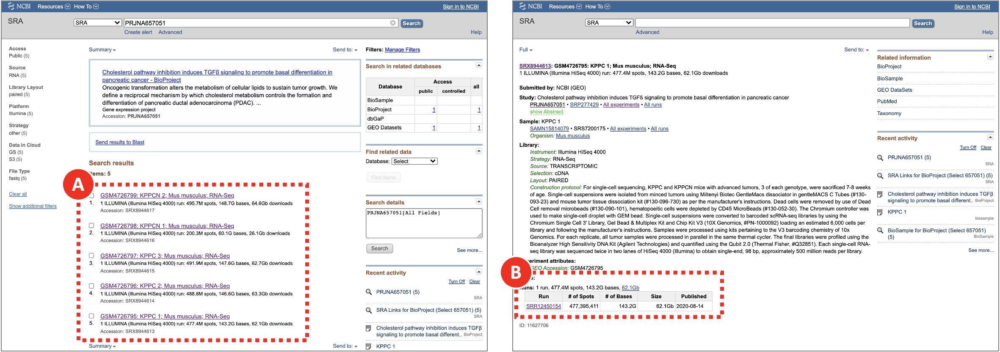
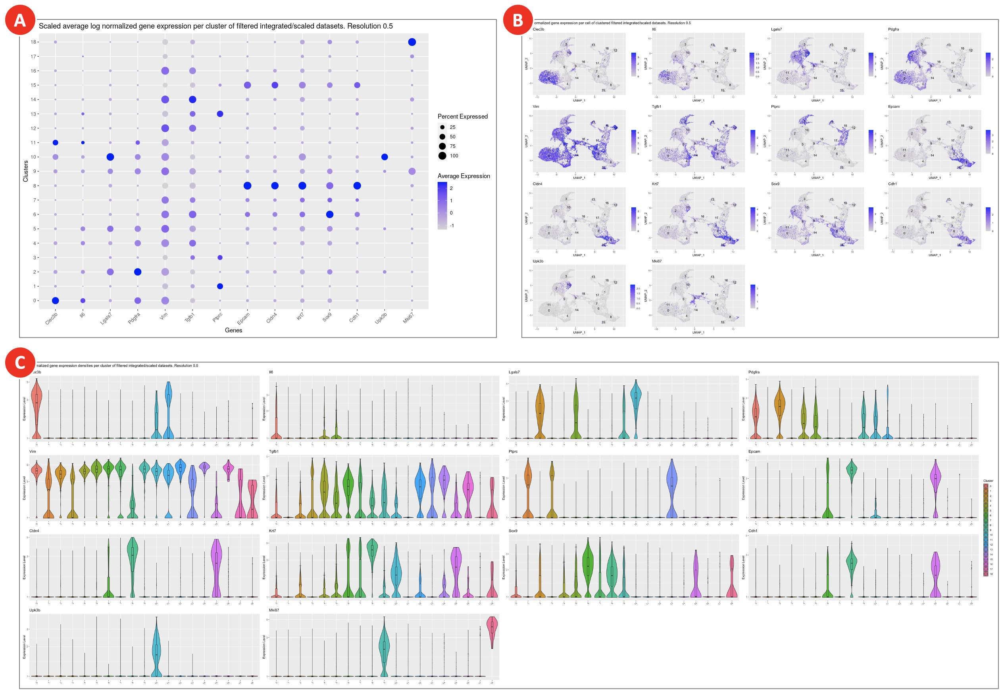

# Bioinformatics analysis of scRNA-Seq data

## Table of Contents
  1. [Create a new project and attach workflows](#step-1-create-a-new-project-and-attach-workflows)
  2. [Build Cell Ranger reference indices](#step-2-build-cell-ranger-reference-indices)
  3. [Quantify gene expression](#step-3-quantify-gene-expression)
  4. [Aggregate cell by gene data from multiple samples](#step-4-aggregate-cell-by-gene-data-from-multiple-samples)
  5. [Cluster and identify gene markers](#step-5-cluster-and-identify-gene-markers)
  6. [Explore clustering results](#step-6-explore-clustering-results)

--------

To describe the use case scenario for our workflows we would like to refer to the **[Cholesterol Pathway Inhibition Induces TGF-beta Signaling to Promote Basal Differentiation in Pancreatic Cancer](https://pubmed.ncbi.nlm.nih.gov/32976774/)** paper (Gabitova-Cornell et al., 2020).

In the original paper, analysis of scRNA-Seq data was conducted by manual command line and R processing. However, due to potential changes in tool versions, libraries and execution environments simply repeating the sequence of commands used in processing is likely to produce different results for different users. In order to guarantee the reproducibility and portability of our analytic approach, we converted our analysis into reproducible **Common Workflow Language** ([CWL](https://arxiv.org/abs/2105.07028)) pipelines and executed them on user-friendly **Scientific Data Analysis Platform** ([SciDAP](https://scidap.com)).

We recommend using specialized data analysis platform as it doesn’t require from a user having powerful computational resources. It also keeps data organized and guarantees workflows reproducibility as each workflow step is run inside a [Docker](https://www.docker.com/) container with the preinstalled and tested version of the required software. SciDAP provides a graphical user interface that allows biologists to analyze data using transparent, reproducible, and portable CWL pipelines without the need for coding. After the analysis is complete, biologists can explore results using interactive visualization tools and produce publication-ready images. Advanced users can adjust CWL pipelines and visualizations to suit their specific analysis needs. **Below we will discuss how scRNA-Seq data analysis can be performed in SciDAP**, how analysis parameters are chosen and briefly discuss what happens under the hood. Alternatively, the same pipelines can be executed in any other CWL-based execution environments (see [CWL official page](https://www.commonwl.org/#Implementations) for a list of available runners), but without the graphical interface described here.

## **Step 1.** Create a new project and attach workflows

In SciDAP, projects keep data organized by the study. Attaching workflows to projects ensures that similar data are processed by compatible pipelines.

- Log in or create a new user account on [SciDAP](https://scidap.com). Follow the on-screen guides to setup your own laboratory or to join an existing one.
- Create a new project by clicking the **New Project** button on the **Projects** page.
- Set an arbitrary **Project title** and **Project subtitle** to distinguish the newly created project from the others (Figure 1A). Optionally, add detailed project description in the **Abstract** field below the **Project subtitle** section (Figure 1B).
- Select the following workflows (Figure 1C) for scRNA-Seq data analysis. For your convenience, use the search bar to find the required workflows faster.
  - Cell Ranger Build Reference Indices
  - Cell Ranger Count Gene Expression
  - Cell Ranger Aggregate
  - Seurat Cluster

***Figure 1. Creating a new project for scRNA-Seq data analysis***

*Setting project title and subtitle helps to distinguish it from the other projects (A). A detailed project description can be added as a Markdown-formatted text (B). Since there are many ways to process the same data, only workflows that have been attached to the project can be used for data analyses to ensure that samples are directly comparable(C). The list of available workflows can be edited after project creation as well.*

## **Step 2.** Build Cell Ranger reference indices

To build reference genome indices [Cell Ranger](https://support.10xgenomics.com/single-cell-gene-expression/software/pipelines/latest/what-is-cell-ranger) runs [STAR](https://github.com/alexdobin/STAR). Genome indices are used to make alignment algorithm fast and efficient. For Cell Ranger both genome sequences ([FASTA](https://software.broadinstitute.org/software/igv/FASTA)) and gene annotation ([GTF](https://software.broadinstitute.org/software/igv/GFF)) files should be provided. The gene annotation file is required for splice junction extraction which improves mapping accuracy of scRNA-Seq data. More details about preparing genome references for Cell Ranger can be found in the official 10X Genomics [documentation](https://support.10xgenomics.com/single-cell-gene-expression/software/pipelines/latest/using/tutorial_mr).

- Create a new experiment by clicking the **Add sample** button on the **Sample** tab.
- Select **Cell Ranger Build Reference Indices** workflow from the **Experiment type** dropdown menu (Figure 2A).
- On the **General info** tab set an arbitrary **Experiment short name** to distinguish the newly created sample from the others. Select **Mus Musculus (mm10)** genome from the **Genome type** dropdown menu (Figure 2B). Optionally, add detailed experiment description in the **Details** section (Figure 2C). SciDAP already has the genome and annotation in its database and they will be used for indexing.
- Click the **Save sample** button at the bottom of the screen.
- Proceed to the next step after building Cell Ranger reference indices finished successfully.

***Figure 2. Building Cell Ranger reference indices***

*After the user selects experiment type (A), they are presented with a form that allows to specify experiment/analysis parameters (B). SciDAP automatically creates these input forms based on CWL pipelines. Optional experiment details can be added as a Markdown-formatted text (C).*

## **Step 3.** Quantify gene expression

Cell Ranger gene expression quantification starts with read trimming (for Single Cell 3’ Gene Expression) and running STAR for splice-aware read alignment. Only the reads that are uniquely mapped to transcriptome are used for analysis. PCR duplicate reads are removed based on Unique Molecular Identifiers (UMI). Cell Ranger supports automatic sequencing error corrections in UMIs, that allows to save more reads. The unique reads that have valid cell barcodes and UMIs, and that are mapped to exactly one gene are used to create cell by gene matrix. More details about Cell Ranger gene expression quantification algorithm can be found in the official [documentation](https://support.10xgenomics.com/single-cell-gene-expression/software/pipelines/latest/algorithms/overview).

- Create a new experiment by clicking the **Add sample** button on the **Sample** tab.
- Select **Cell Ranger Count Gene Expression** workflow from the **Experiment type** dropdown menu (Figure 3A).
 - On the **General info** tab set an arbitrary **Experiment short name** to distinguish the newly created sample from the others. Select the experiment with the Cell Ranger reference indices from the **Genome type** dropdown menu (Figure 3B). Optionally, add detailed experiment description in the **Details** section.
- Click the Use **File Manager** button under the **FASTQ file R1** label (Figure 3C).
- On the **Attach from URL** tab provide SRR run accession number in a form of **geo://SRR12450154** (Figure 3D). Click the **Use custom URL** button.
- Provide the same SRR run accession number when clicking the **Use File Manager** button under the **FASTQ file R2** label.
- Click the **Save sample** button at the bottom of the screen.
- Repeat the same steps for each experiment to be analyzed (e.g. every SRX run in the  **PRJNA657051** BioProject). **KPPC 1 SRR12450154** dataset is shown as an example. To obtain a list of required SRR run accession numbers open https://www.ncbi.nlm.nih.gov/sra/?term=PRJNA657051 (Figure 4A) and copy SRR identifiers for each of the SRX experiments (Figure 4B).
- Proceed to the next step after gene expression quantification finished successfully for all five datasets.

If sequence data from the multiple SRR runs belong to the same SRX experiment and should be processed as a single sample, SRR run accession numbers should be provided in a form of comma-separated list. In addition to downloading from NCBI SRA, **Attach from URL** tab also supports direct URLs to the FASTQ files deposited to other repositories. Alternatively, input FASTQ files can be uploaded from the user’s computer using **File Manager** tab or downloaded from the FTP server through **FTP Connection** tab.

The results of each successfully finished gene expression quantification experiment can be explored in a form of web-based report generated by Cell Ranger, and interactively in the [UCSC Cell Browser](https://cellbrowser.readthedocs.io/en/master/). Additionally, a file compatible with the [Loupe Browser](https://support.10xgenomics.com/single-cell-gene-expression/software/visualization/latest/what-is-loupe-cell-browser) can be downloaded from the **Files** tab. The user is presented with QC measures including the number of reads mapped to intergenic, exonic or intronic regions; the barcode rank plot and others.

***Figure 3. Gene expression quantification for KPPC 1 SRR12450154 dataset***

*Experiment entry form allows user to select workflow type (A), set general parameters (B) and attach data files or provide accession number/URL to the data (C). For data from NCBI short read archive (SRA) SciDAP will automatically download and extract raw sequencing data into a pair of FASTQ files based on the SRR accession number (D). Same SRR number should be provided for both FASTQ R1 and R2 input files (C).*

***Figure 4. Searching for SRR run accession numbers that belong to the PRJNA657051 BioProject***

*On NCBI SRA the raw sequencing data is saved in a form of SRA archives that can be accessed by their SRR run accession numbers. Multiple SRR runs can belong to the same SRX/GSM sample which in turn belongs to an SRP/GSE study. The same pages can be found through via GEO search.*

## **Step 4.** Aggregate cell by gene data from multiple samples

To proceed to the clustering analysis the results of all five gene expression quantification experiments should be merged into a single feature-barcode matrix. However, since for each scRNA-Seq experiment, cell barcodes were drawn from the same pool of whitelisted barcodes, a simple merging may result in having duplicated barcodes. To avoid this scenario Cell Ranger updates each barcode with an integer suffix pointing to the dataset the cell came from before running aggregation. Optionally, Cell Ranger may run depth normalization algorithm to make all merged datasets have similar number of uniquely mapped to transcriptome reads per cell. This approach may be suboptimal since all data will be downsampled to match the worst sample. Here we aggregate samples without normalization, leaving normalization to Seurat. More details about Cell Ranger aggregation algorithm can be found in the official [documentation](https://support.10xgenomics.com/single-cell-gene-expression/software/pipelines/latest/using/aggregate).

- Create a new experiment by clicking the **Add analysis** button on the **Analysis** tab.
- Select **Cell Ranger Aggregate** workflow from the **Experiment type** dropdown menu (Figure 5A).
- On the **General info** tab set an arbitrary **Experiment short name** to distinguish the newly created sample from the others. Select all five Cell Ranger Count Gene Expression experiments from the **scRNA-Seq Cell Ranger Experiment** dropdown menu (Figure 5B). Optionally, add detailed experiment description in the **Details** section.
- On the **Advanced** tab set **Library depth normalization mode** to **None** (Figure 5C).
- Click the **Save sample** button at the bottom of the screen.
- Proceed to the next step after gene expression aggregation finished successfully.

The results of successfully finished gene expression aggregation experiment can be explored in a form of web-based report generated by Cell Ranger, and interactively in the [UCSC Cell Browser](https://cellbrowser.readthedocs.io/en/master/). Additionally, a file compatible with the [Loupe Browser](https://support.10xgenomics.com/single-cell-gene-expression/software/visualization/latest/what-is-loupe-cell-browser) can be downloaded from the **Files** tab.

***Figure 5. Aggregating gene expression from multiple datasets***

*For Cell Ranger Aggregate workflow (A) setting library depth normalization to None (C) will disable the default behavior of normalizing the average read depth per cell between merged datasets (B). Normalization will be applied when integrating datasets with Seurat.*

## **Step 5.** Cluster and identify gene markers

The joint analysis of multiple scRNA-Seq datasets with [Seurat](https://satijalab.org/seurat/) starts with evaluation of common  single-cell quality control (QC) metrics – genes and UMIs counts, percentage of mitochondrial genes expressed. QC allows to get a general overview of the datasets quality as well as to define filtering thresholds for dead or low-quality cells removal. Filtered merged datasets are then being processed with the integration algorithm. Its main goal is to identify integration anchors – pairs of cells that can “pull together” the same cell type populations from the different datasets. An integration algorithm can also solve batch correction problem by regressing out the unwanted sources of variation. The integrated data then undergo the dimensionality reduction processing that starts from the principal component analysis (PCA). Based on the PCA results the uniform manifold approximation and projection (UMAP) and clustering analysis are run with the principal components of the highest variance. Clustered data are then used for gene markers identification. These genes are differentially expressed between clusters and can be used for cell types assignment. More details about scRNA-Seq integration analysis with Seurat can be found in the official [documentation](https://satijalab.org/seurat/articles/integration_introduction.html).

- Create a new experiment by clicking the **Add analysis** button on the **Analysis** tab.
- Select **Seurat Cluster** workflow from the **Experiment type** dropdown menu (Figure 6A).
- On the **General info** tab set an arbitrary **Experiment short name** to distinguish the newly created sample from the others. Select Cell Ranger Aggregate experiment from the **scRNA-Seq Cell Ranger Aggregate Experiment** dropdown menu (Figure 6B). Optionally, add detailed experiment description in the **Details** section.
- On the **Advanced** tab (Figure 6C) set workflow execution parameters listed in the **Adjusted** column of Table 1. The logic behind updating the default clustering parameters is explained in the **Explore clustering results** section. With a new dataset, we recommend to first perform analysis using the default parameters and then based on QC results adjust the parameters and repeat the Seurat analysis.
- In a text editor or Microsoft Excel create comma-separated **condition.csv** file to assign each dataset to either KPPC or KPCCN group (Table 2). **library_id** column includes values used in **Experiment short name** fields of Cell Ranger Count Gene Expression experiments, **condition** column defines the group to which each dataset should be assigned.
- Click the Use **File Manager** button (Figure 6D) to upload newly created **condition.csv** file.
- On the **File Manager** tab click **Upload** button and find previously saved **condition.csv** file. Once the file is successfully uploaded select it from the list and click the **Attach** button (Figure 6E).
- Click the **Save sample** button at the bottom of the screen.
- Proceed to the next step after clustering and gene markers identification finished successfully.

***Figure 6. Clustering and gene markers identification***

*For Seurat Cluster workflow (A) the file defining sample groups can be uploaded though the experiment entry form (D,E). In case it is not provided each dataset will be assigned to its own separate group. The default filtering and clustering parameters can be adjusted on the Advanced tab (C).*

***Table 1. Advanced filtering, clustering and gene markers identification parameters***

| Parameter | Default | Adjusted |
|---|---|---|
| Include genes detected in at least this many cells | 10 | 10 |
| Include cells where at least this many genes are detected | 250 | 3001 |
| Include cells with the number of genes not bigger than this value | 5000 | 62001 |
| Include cells where at least this many UMIs are detected | 500 | 500 |
| Include cells with the novelty score (the ratio of genes per cell over UMIs per cell) not lower than this value | 0.8 | 0.8 |
| Include cells with the percentage of transcripts mapped to mitochondrial genes not bigger than this value | 5 | 5 |
| Pattern to identify mitochondrial genes | ^Mt- | ^mt-2 |
| Number of highly variable genes to detect (used for dataset integration and dimensional reduction) | 3000 | 3000 |
| Number of principal components to use in UMAP projection and clustering (from 1 to 50) | 10 | 203 |
| The effective scale of embedded points on UMAP. In combination with the parameter below determines how clustered/clumped the embedded points are. | 1 | 1 |
| Controls how tightly the embedding is allowed compress points together on UMAP. Larger values ensure embedded points are more evenly distributed, while smaller values allow the algorithm to optimise more accurately with regard to local structure. Sensible values are in the range 0.001 to 0.5. | 0.3 | 0.3 |
| Determines the number of neighboring points used in UMAP. Larger values will result in more global structure being preserved at the loss of detailed local structure. In general this parameter should often be in the range 5 to 50. | 30 | 30 |
| Regress cell cycle as a confounding source of variation | False | False |
| Regress mitochondrial gene expression as a confounding source of variation | False | False |
| Clustering resolution | 0.1 | 0.54 |
| Include only those genes that on average have log fold change difference in expression between every tested pair of clusters not lower than this value | 0.25 | 0.25 |
| Include only those genes that are detected in not lower than this fraction of cells in either of the two tested clusters | 0.1 | 0.1 |
| Statistical test to use for gene markers identification | wilcox | wilcox |
| Report only positive gene markers | False | True5 |
| Comma or space separated list of genes of interest | None | Clec3b, Il6, Lgals7, Pdgfra, Vim, Tgfb1, Ptprc, Epcam, Cldn4, Krt7, Sox9, Cdh1, Upk3b, Mki676 |

*1 Adjusted to remove outliers based on the genes per cell density distribution violin and ranked cells plots.*

*2 Mitochondrial genes from mouse genome start with lowercase “mt-“.*

*3 Adjusted to point to PC20 where the curve on the Elbow plot starts to plateau.*

*4 Adjusted based on the expected number of cell types.*

*5 Uses only genes that are overexpressed in a given cluster as putative markers. If False, both overexpressed and silent genes will be reported.*

*6 Genes of biological interest can be selected for plotting.*

***Table 2. Comma-separated condition.csv file to define datasets grouping***

| library_id | condition |
|---|---|
| KPPC 1 SRR12450154 | KPPC |
| KPPC 2 SRR12450155 | KPPC |
| KPPCN 2 SRR12450158 | KPPCN |
| KPPC 3 SRR12450156 | KPPC |
| KPPCN 1 SRR12450157 | KPPCN |

## **Step 6.** Explore clustering results

Cell Ranger Count Gene Expression pipeline uses advanced cell-calling algorithm that allows to identify high-quality cells from each dataset. It also runs a preliminary clustering analysis that may be sufficient for some cases. However, in addition to that, we recommend exploring commonly used QC metrics for the merged datasets that are produced by Seurat. These will help to evaluate how filtering parameters influence the number of remaining cells, define datasets dimensionality, perform clustering, identify gene markers, and evaluate expression levels of genes of interest to assign cell types to clusters. All of these are accessible on the **QC (not filtered)**, **QC (filtered)**, **Dimensionality evaluation**, **QC (integrated)**, **Clustering**, **Gene expression**, and **Putative gene markers** tabs of the successfully finished clustering experiment.

- Cell count bar plot (Figure 7A) allows to examine the number of cells per dataset. Cell counts mainly depend on the number of loaded cells and on the capture efficiency of the used single-cell protocol. The minimum required number of cells can be estimated based on the assumed number of cell types, the minimum fraction of the rarest cell type in population, and the minimum required number of cells per type (see more details [here](https://satijalab.org/howmanycells/)).
- The violin plots (Figure 7B) are used to visualize per cell density distributions of the following metrics: UMI counts, gene counts, the percentage of transcripts mapped to mitochondrial genes, and novelty score. Embedded box plots help to spot outliers and define filtering thresholds for each metrics. In general, it is recommended to filter out all of the cells with less than 500 UMIs per cell. The abundance of cells with low UMIs per cell values may indicate a small number of reads uniquely mapped to transcriptome or low sequencing depth. The percentage of transcripts mapped to mitochondrial genes correlates with the number of dying cells. In most of the cases cells with more than 5% of the reads mapped to mitochondrial genes should be discarded. The novelty score indicates the complexity of the dataset and is calculated as the ratio of genes per cell over UMIs per cell. Typically, novelty score should be above 0.8. Higher novelty score implies higher diversity of genes per UMIs and requires more cells to be called per dataset.
- To evaluate the lower and upper limits for gene per cell counts not only the density distribution (Figure 7B, 7C, 7D), but also the cell rank plot (Figure 7E) can be used. The latter allows to visually identify the cells with extremely low or extremely high number of genes for each dataset. In general, to filter out low-quality cells or empty droplets the minimum threshold for gene per cell counts should be set to 500. Setting the upper limit for this metrics can be used to remove cell doublets.
- All three metrics combined (UMI counts, gene counts, the percentage of transcripts mapped to mitochondrial genes) are shown on the genes per cell over UMIs per cell correlation plot (Figure 7F). This plot can be used to evaluate whether a certain threshold have already discarded all unnecessary cells, so the other filtering criteria can be omitted, thus avoiding accidental removal of viable cell populations.

***Figure 7. QC metrics for not filtered merged datasets***

*Genes per cell density distribution plot (C) is split into KPPC and KPPCN groups. Zoomed in section of the density plot (D) displays all 5 datasets within the selected boundaries. Cell rank plot (E) displays cells sorted by gene per cell counts within each dataset. The lower and upper limits for genes per cell values are shown for each dataset separately. On the genes per cell over UMIs per cell correlation plot (F) the vertical lines indicate the minimum thresholds for UMIs per cell values. All the cells with the percentage of transcripts mapped to the mitochondrial genes below 5% are marked as blue.*

- A combined effect of filtering by UMI counts, gene counts, and by the percentage of mitochondrial reads is shown on the genes per cell over UMIs per cell correlation plot (Figure 8A). The plot displays the remaining cells after all QC filters have been applied.
- The Elbow plot (Figure 8B) is used to evaluate the dimensionality of the filtered integrated datasets by selecting only those principal components that capture the majority of the data variation. Typically, it is defined by the principal component after which the plot starts to plateau.
- UMAP plot shows cell clusters in the filtered integrated dataset (Figure 8C). The same plot but split into KPPC and KPPCN groups (Figure 8D) allows to spot clusters distinctive for each group.

***Figure 8. QC metrics and dimensional reduction analysis of filtered integrated datasets***

*Combined effect of multiple filtering parameters can be explored on the genes per cell over UMIs per cell correlation plot (A). Elbow plot (B) helps to define datasets dimensionality, but it is rather subjective measure and should not be used as the main criteria. Final clustering results (C) as well as split by condition clusters (D) are used to evaluate cell populations present in datasets.*

- Dot plot with scaled gene expression (Figure 9A) is used to visually evaluate the average expression levels and the percentage of genes of interest per cluster. It helps to explore the similarities between clusters and identify cell types.
- Feature plots (Figure 9B) highlight normalized expression levels of genes of interest over the identified clusters.
- The violin plots (Figure 9C) show the density distributions of the normalized expression levels of genes of interest per cluster. Altogether with abovementioned plots they are used for manual assigning cell types to clusters.

***Figure 9. Gene expression plots for assigning cell types to clusters***

*Clusters on a dot plot (A) are grouped together based on the similarities of the expression levels of genes of interest. On the feature plots (B) cells are highlighted correspondingly to the normalized expression levels of each of the genes of interest. Violin plots (C) show gene expression for genes of interest in each cluster.*

- Clustering results loaded in UCSC Cell Browser allow to interactively explore identified clusters (Figure 10A), highlight cells belonging to various samples and conditions (Figure 10B), explore the main QC metrics (Figure 10C), show expression of genes of interest, and export barcodes of selected cells (Figure 10D) for further analyses.

***Figure 10. Clustering results visualized in UCSC Cell Browser (next page)***

*Depending on the option selected on the Annotation tab, UCSC Cell Browser highlights identified clusters (A), groups datasets by specified condition (B), colors cells based on the percentage of mitochondrial genes expressed (C), and generates a barcodes list for a selected group of cells (D).*

- On the **Putative gene markers** tab (Figure 11A) an interactive table includes gene markers for each cluster. The column names correspond to the output of [FindAllMarkers](https://www.rdocumentation.org/packages/Seurat/versions/4.0.3/topics/FindAllMarkers) function Seurat 4.0.3 R package. On the **Files** tab (Figure 11B) the list of all generated files is available for download. Among these files the **seurat_clst_data_rds.rds** (Figure 11C) includes Seurat clustering data in a format compatible with RStudio.

***Figure 11. Gene markers identification and direct download of workflow execution results***

*In the gene markers table, the values in **avg_log2FC** column are calculated as a log2 fold change difference between the average gene expression in the current cluster compared to all other clusters combined. The **pct.1** and **pct.2** columns show the percentage of cells with the specific gene expressed in the current cluster and all other clusters combined. This table can be used to identify gene markers of interest and assign cell types.*